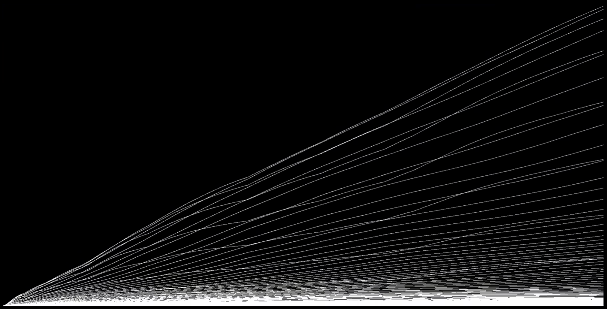
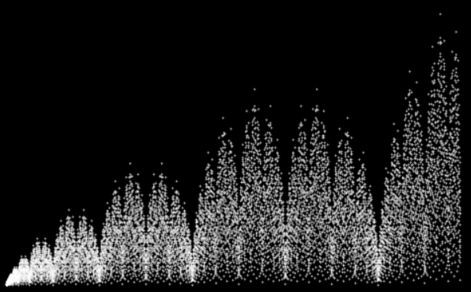
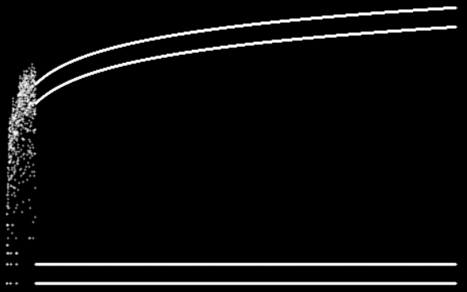
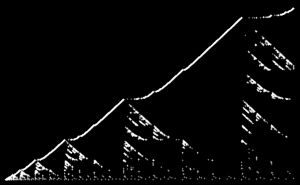
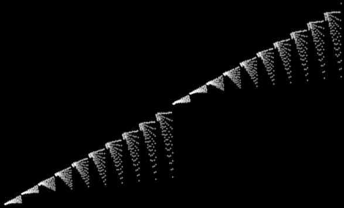
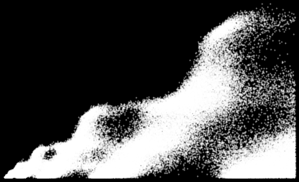

# **Целочисленные Последовательности**

_Выполнил Зайцев А.А. ИКБО-10-22_

- [**Целочисленные Последовательности**](#целочисленные-последовательности)
    - [**Тест Миллера-Рабина**](#тест-миллера-рабина)
    - [**Последовательности**](#последовательности)
        - [**Inventory**](#inventory)
        - [**Stern-Brocot**](#stern-brocot)
        - [**Kolakoski**](#kolakoski)
        - [**Fly straight, dammit!**](#fly-straight-dammit)
        - [**Primes minus their binary reversal**](#primes-minus-their-binary-reversal)
        - [**Remy-Sigrist**](#remy-sigrist)
        - [**Wisteria**](#wisteria)
        - [**Forest Fire**](#forest-fire)

## **Тест Миллера-Рабина**

Тест Миллера-Рабина (_Miller-Rabin test_) - это алгоритм, который используется для проверки того, является ли число простым. Он основан на вероятностном подходе и использует теорему Ферма, чтобы определить, является ли число простым с высокой степенью точности, но также есть и версия алгоритма, позволяющая со 100% точностью узнать простоту числа.

Алгоритм работает следующим образом:

Выбирается случайное целое число a (1 < a < n), где n - число, которое нужно проверить на простоту.
Вычисляется степень d числа n-1 и остаток r от деления n-1 на 2: n-1 = d \* 2^r.
Выполняется следующий цикл:

1. вычисляется x = a^d mod n.
2. если x != 1 и x != n-1, то проверка заканчивается и число является составным.
3. В противном случае проверка продолжается, пока не будут проверены все нужные числа.

## **Последовательности**

Далее представлены последовательности целых чисел, которые имеют интересные свойства или точечные графики.

-   примечание - все последовательности взяты с сайта [Online Encyclopedia of Integer Sequences](https://oeis.org/)

### **Inventory**

Код: A342585

Первые 100 миллионов чисел. Изначально график выглядит очень хаотично, однако на огромных значениях структура проглядывается.

### **Stern-Brocot**

Код: A002487

Первые 10 тысяч чисел. Похоже на какой-нибудь собор или церковь.

### **Kolakoski**

Код: A000002

1, 2, 2, 1, 1, 2, 1, 2, 2, 1, 2, 2...

Эта последовательность описывает себя:

Если посчитать, сколько раз встречается подряд идущая цифра 1 или 2, то получится та же последовательность:

1 единица, 2 двойки, 2 единицы, 1 двойка, 1 единица и т.д.

### **Fly straight, dammit!**

Код: A133058

Первые 10 тысяч чисел. Этот график очень похож на сцену из фильма Аватар, где Джейк учится летать на Икране. Сначала ничего не выходит и полёт хаотичен, однако в один момент он начинает лететь плавно.

### **Primes minus their binary reversal**

Код: A265326

Первые 25 тысяч чисел. Бесконечно много параллелограммов, где каждый последующий в 2 раза больше предыдущего.

### **Remy-Sigrist**

Код: A279125

Первые 10 тысяч чисел. Похоже на Альпы.

### **Wisteria**

Код: A063543

Первые 2 тысячи чисел. Похоже на листву Глицинии.

### **Forest Fire**

Код: A229037

Первые 10 тысяч чисел. Похоже на дым (или волны).
